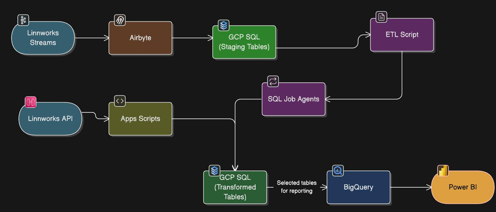

# Linnworks Data Pipeline

  

## Overview
This project implements an **end-to-end data pipeline** for **ingesting, transforming, and delivering Linnworks data** for reporting and analytics. The pipeline ensures that raw data from Linnworks is:

- Efficiently ingested through APIs and streams  
- Cleaned, transformed, and standardized for analytics  
- Delivered to **BigQuery** for consumption by **Power BI dashboards**  

The goal is to provide a robust, automated, and maintainable system that enables business teams to generate insights.

---

## Architecture
The pipeline follows a classic **ETL (Extract, Transform, Load) workflow**, with the following stages:  

1. **Data Ingestion** – Collect data from Linnworks via APIs and streams, using Airbyte and Google Apps Scripts.  
2. **Data Transformation** – Process and standardize raw data in GCP SQL using ETL scripts and SQL job agents.  
3. **Data Delivery** – Load processed data into BigQuery for downstream analytics and visualization in Power BI.  

  

---

## Data Flow

### 1. Data Ingestion
- Data from Linnworks is streamed via **Airbyte** connectors and extracted using **Apps Scripts**.  
- Raw data is stored in **staging tables** in GCP SQL.  
- The process supports incremental and full data loads.  

### 2. Data Transformation
- **ETL scripts** transform and clean data: removing duplicates, normalizing formats, and denormalizing tables where necessary from Json to relational structure etc 
- Transformation scripts are executed via **Job agents** in GCP SQL.  
- Denormalized tables are designed for efficient querying and analytics.  

### 3. Data Delivery
- Transformed tables are loaded into **BigQuery**.  
- Selected tables are exposed to **Power BI dashboards** for reporting.  

---

## Linnworks Tables & Streams
The following tables are extracted from Linnworks and processed through Airbyte:

| Table Name                 | Source Stream           |
|-----------------------------|------------------------|
| `Processed_order_details`   | Orders Stream          |
| `Processed_orders`          | Orders Stream          |
| `stock_items`               | Stock Items Stream     |
| `Stock_location_details`    | Stock Locations Stream |
| `Stock_locations`           | Stock Locations Stream |

Additional reference: [Linnworks ERD Diagram](https://docs.linnworks.com/resources/Storage/documentation/Files/LW_Database_structure_image.png)

---

## Project Structure

- **docs/** – Documentation for mapping
- **etl/** – ETL scripts and workflows
- **img/** – Images used in README 
- **logs/** – Execution logs
- **migrations/** – Incremental database changes (versioned)
- **notebooks/** – Jupyter notebooks for exploration and validation
- **schema/** – Base DDL SQL scripts
- **scripts/** – Utility scripts (backup, restore, pipeline run, etc.)
- **src/** – Python ETL source code
- **tests/** – Unit tests and SQL tests
- **README.md** – Project overview and instructions
- **requirements.txt** – Python dependencies

## To-Do

- Document the **column-to-stream mapping** for all denormalized tables.  
- Enhance **data validation tests** for consistency across staging and transformed layers.  
- Follow **Same naming nomenclature**  acroos all tables 
- Maintain **version control** for all schema and migration scripts.  
- Automate Failure Logs to emails
